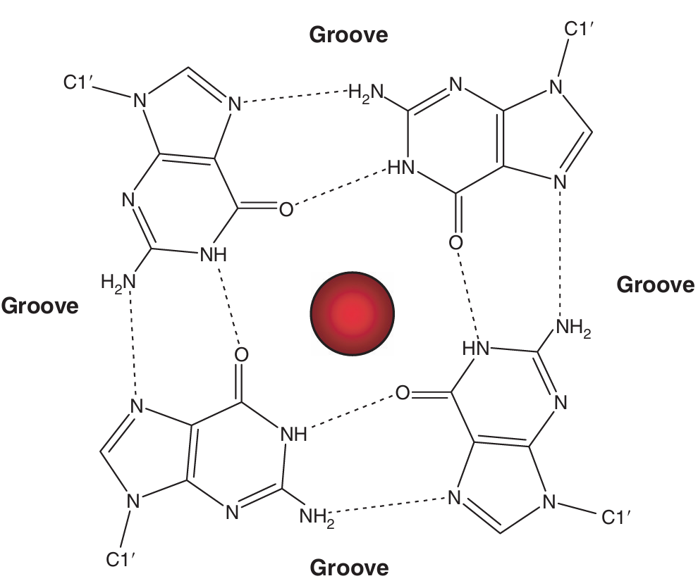
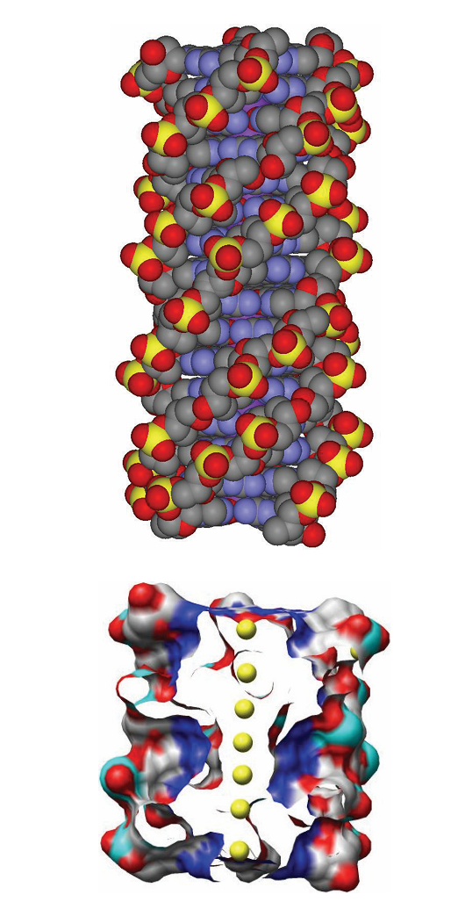
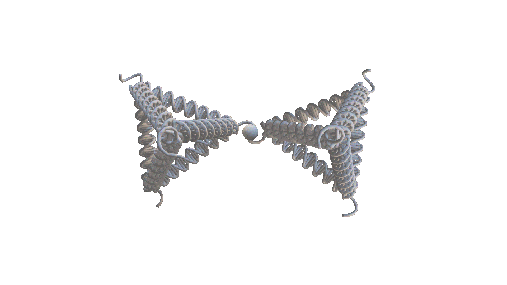
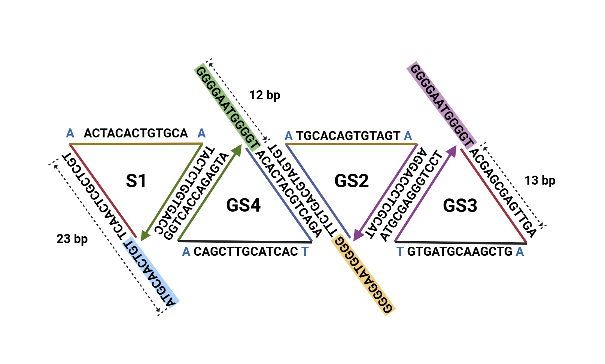
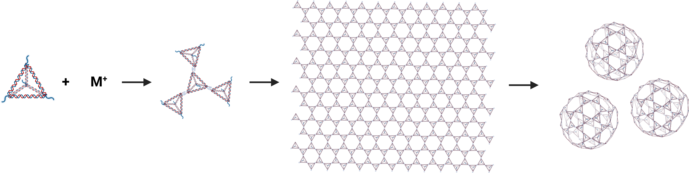
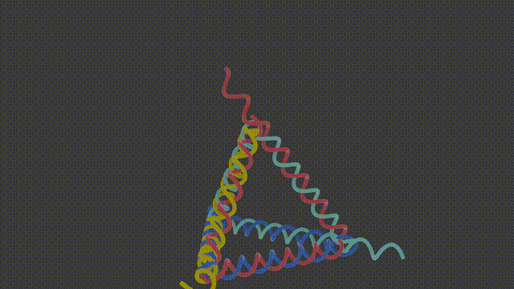

# **Design**

#### **How we design GPT** **？**

我们设计了一种由DNA四面体（TDN）为结构单元，以G四链体为链接的生物超分子组装材料，该工具即可通过无基质自组装形成二维DNA膜，又可在离子浓度等调控下，自发卷曲成三维囊泡。而DNA四面体和G四链体自身的特性，又赋予了该工具极强的生物相容性，广泛的可修饰性，灵敏的离子响应度等一系列优势。

我们选用了G四链体作为DNA四面体单体之间的linker。含有重复G碱基的DNA序列可以通过Hoogsteen氢键连接形成G四链体，其基本结构单元是四个鸟嘌呤碱基通过氢键平面排列形成的G-四联体（G-quartet）[1,2]。G四链体的形成与稳定依赖一价阳离子的参与，这些阳离子被容纳于G四链体的中央通道中，与鸟嘌呤的羰基氧原子配位，中和负电荷，从而显著稳定整个结构[1,2]。其序列常为*Gm* *Xn* *Gm* *Xo* *Gm* *Xp* *Gm*，where m is the number of G residues in each short G-tract, which are usually directly involved in G-tetrad interactions. Xn,Xo and Xp can be any combination of residues, including G, forming the loops。G四链体不仅能够由一条链形成，还能够由两条带有*Gm* *Xn* *Gm*的序列共同组成[1]。在我们的设计中，两个单体通过其上带有的连接序列，在金属阳离子的作用下形成G四链体连接到一起。

**图一**

**图二**

**图三**

选择G四链体作为linker也会减小该生物超分子组装材料产生卷曲的临界半径，这将有助于后续探究如何将其卷成球囊：一方面，对DNA四面体与G四链体之间连接的碱基序列长度的选择有助于我们调节连接的刚性从而调节临界半径；另一方面，G四链体的键能较大，这会增大暴露边缘的能量损失，催动着系统更通过弯曲闭合来减少边界【2010年文章的公式和示意图，展示出正反比关系】

这种由G四链体连接的方法有以下特点：1.常温组装，在常温下，我们将单体与组装所使用的离子溶液混合，便能够进行组装，得到组装体，避免反应所需高温对DNA结构和组装材料上负载的药物或酶的破坏。2.可控开合，在钾离子等金属阳离子的作用下，G四链体形成，单体相互连接，当我们加入冠醚类物质时，单价金属阳离子与冠醚结合，G四链体打开[3–5]。

这个特性使得我们能够更便捷灵活地调整组装完成后的纳米结构的功能。

我们二维材料的构建单元是经过修饰的DNA四面体。DNA四面体，是一种由四条DNA单链通过一步退火合成的一种框架DNA结构6。每条DNA单链与另外三条单链相互进行碱基互补配对，便形成这种具有高生物相容性[6]、高结构稳定性[6,7]、并且细胞摄取率高[8]、可功能化修饰[9–11]的四面体DNA结构。

我们在其中三条单链的5`段延伸了*Gm* *Xn* *Gm*序列，组装成DNA四面体之后，这些序列可在单价金属阳离子的作用下相互连接。

此外，在DNA四面体第四条DNA单链的5`段，我们延伸了一段用来负载功能基团的DNA序列。通过以下步骤，我们might能够自由控制我们的二维超分子材料的结构并在其上模块化集成所需的功能：

1.一步退火合成DNA四面体

2.DNA四面体的一条延伸链与负载功能团的DNA链在常温!下进行碱基互补配对，对DNA四面体进行功能化修饰。

3.选择所用结构与功能，按所需比例混匀进行了不同的功能化修饰的DNA四面体，加入对应金属阳离子，组装形成多功能集成的二维纳米薄膜或囊泡。

 

(1)  Burge, S.; Parkinson, G. N.; Hazel, P.; Todd, A. K.; Neidle, S. Quadruplex DNA: Sequence, Topology and Structure. *Nucleic Acids Research* **2006**, *34* (19), 5402–5415. https://doi.org/10.1093/nar/gkl655.

(2)  Lane, A. N.; Chaires, J. B.; Gray, R. D.; Trent, J. O. Stability and Kinetics of G-Quadruplex Structures. *Nucleic Acids Research* **2008**, *36* (17), 5482–5515. https://doi.org/10.1093/nar/gkn517.

(3)  Dong, J.; O’Hagan, M. P.; Willner, I. Switchable and Dynamic G-Quadruplexes and Their Applications. *Chem. Soc. Rev.* **2022**, *51* (17), 7631–7661. https://doi.org/10.1039/D2CS00317A.

(4)  Zhou, Z.; Fan, D.; Wang, J.; Sohn, Y. S.; Nechushtai, R.; Willner, I. Triggered Dimerization and Trimerization of DNA Tetrahedra for Multiplexed miRNA Detection and Imaging of Cancer Cells. *Small* **2021**, *17* (6), 2007355. https://doi.org/10.1002/smll.202007355.

(5)  Wang, C.; Fadeev, M.; Vázquez‐González, M.; Willner, I. Stimuli‐Responsive Donor–Acceptor and DNA‐Crosslinked Hydrogels: Application as Shape‐Memory and Self‐Healing Materials. *Adv Funct Materials* **2018**, *28* (35), 1803111. https://doi.org/10.1002/adfm.201803111.

(6)  Li, S.; Tian, T.; Zhang, T.; Cai, X.; Lin, Y. Advances in Biological Applications of Self-Assembled DNA Tetrahedral Nanostructures. *Materials Today* **2019**, *24*, 57–68. https://doi.org/10.1016/j.mattod.2018.08.002.

(7)  Zagorovsky, K.; Chou, L. Y. T.; Chan, W. C. W. Controlling DNA–Nanoparticle Serum Interactions. *Proc. Natl. Acad. Sci. U.S.A.* **2016**, *113* (48), 13600–13605. https://doi.org/10.1073/pnas.1610028113.

(8)  Li, J.; Pei, H.; Zhu, B.; Liang, L.; Wei, M.; He, Y.; Chen, N.; Li, D.; Huang, Q.; Fan, C. Self-Assembled Multivalent DNA Nanostructures for Noninvasive Intracellular Delivery of Immunostimulatory CpG Oligonucleotides. *ACS Nano* **2011**, *5* (11), 8783–8789. https://doi.org/10.1021/nn202774x.

(9)  Tian, T.; Zhang, T.; Shi, S.; Gao, Y.; Cai, X.; Lin, Y. A Dynamic DNA Tetrahedron Framework for Active Targeting. *Nat Protoc* **2023**, *18* (4), 1028–1055. https://doi.org/10.1038/s41596-022-00791-7.

(10) Lin, M.; Song, P.; Zhou, G.; Zuo, X.; Aldalbahi, A.; Lou, X.; Shi, J.; Fan, C. Electrochemical Detection of Nucleic Acids, Proteins, Small Molecules and Cells Using a DNA-Nanostructure-Based Universal Biosensing Platform. *Nat Protoc* **2016**, *11* (7), 1244–1263. https://doi.org/10.1038/nprot.2016.071.

(11) Li, S.; Tian, T.; Zhang, T.; Lin, Y.; Cai, X. A Bioswitchable Delivery System for microRNA Therapeutics Based on a Tetrahedral DNA Nanostructure. *Nat Protoc* **2025**, *20* (2), 336–362. https://doi.org/10.1038/s41596-024-01050-7.

 