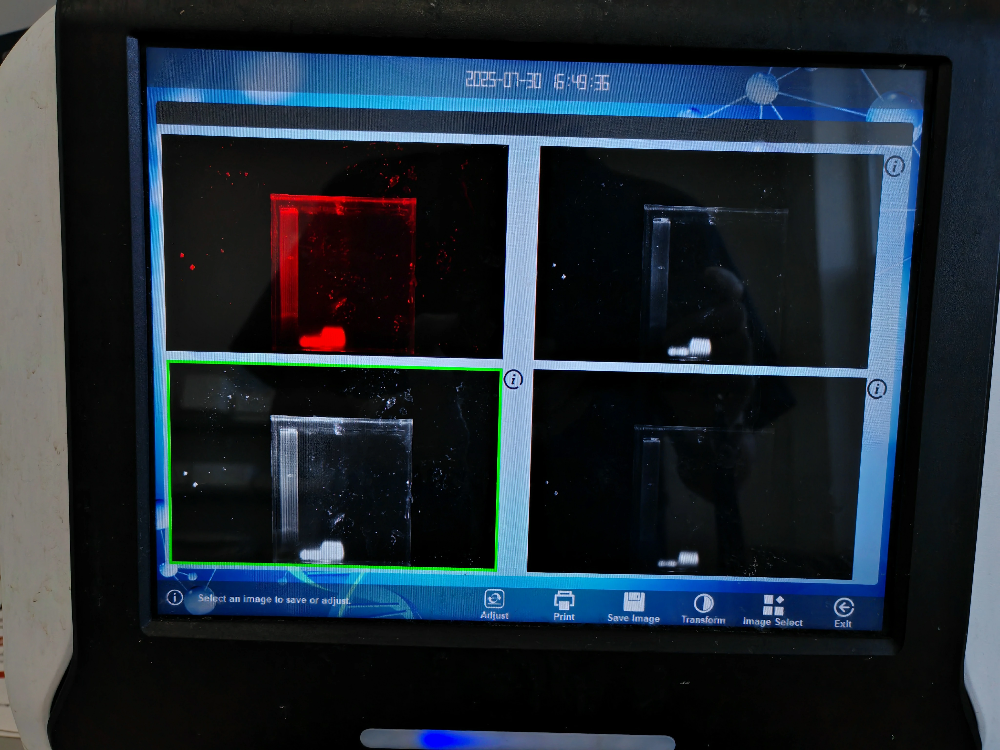
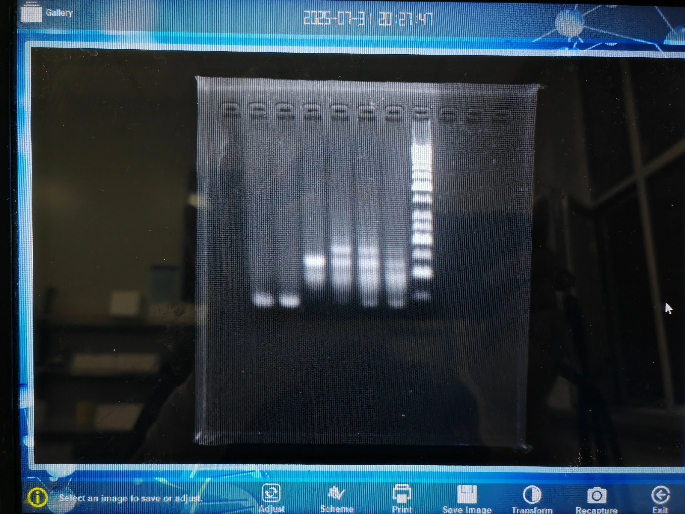
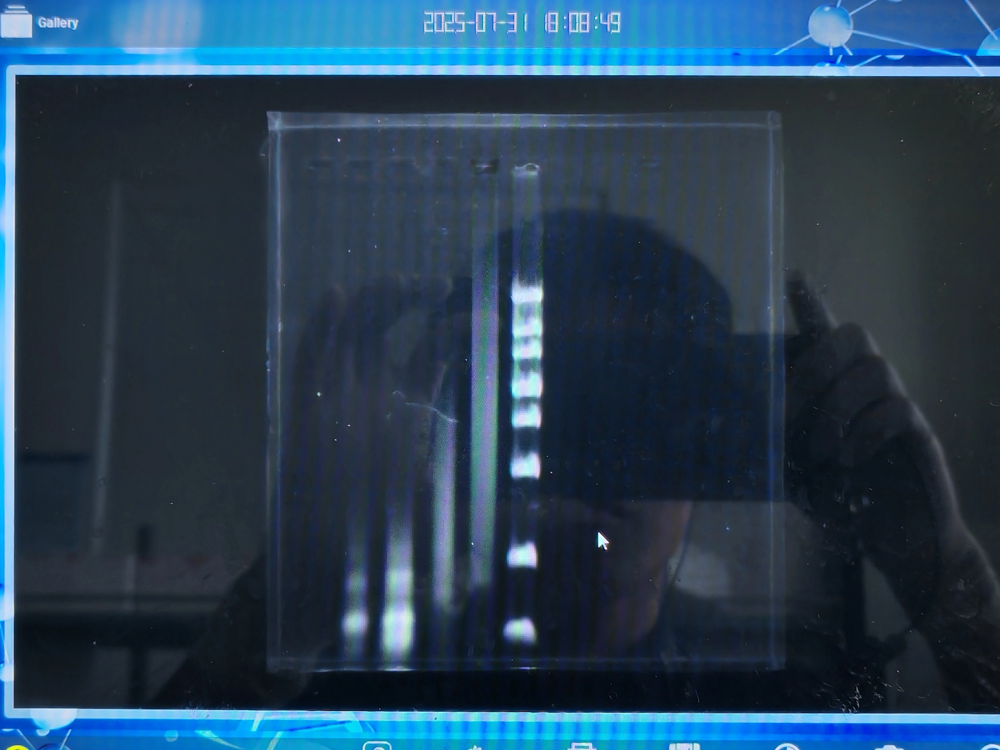

# BIOMOD 2025 实验记录

### 5.27

| 1×TE 缓冲液的配置 |                    |                      |        |
| ----------------- | ------------------ | -------------------- | ------ |
| 药品名            | 0.5M EDTA溶液 pH=8 | 1M Tris-HCl溶液 pH=8 | 超纯水 |
| 体积              | 200ul              | 1000ul               | 98.8ml |

对12管DNA干粉用离心机进行25°C的6500rpm离心2min

| 10uM DNA溶液的配置 |           |        |        |           |        |        |           |        |        |           |        |        |
| ------------------ | --------- | ------ | ------ | --------- | ------ | ------ | --------- | ------ | ------ | --------- | ------ | ------ |
| DNA链              | RDT-A1-G4 | RDT-A2 | RDT-A3 | RDT-B1-G4 | RDT-B2 | RDT-B3 | RDT-C1-G4 | RDT-C2 | RDT-C3 | RDT-D1-S1 | RDT-D2 | RDT-D3 |
| 对应缓冲液体积/ul  | 214       | 244    | 250    | 224       | 254    | 245    | 226       | 255    | 255    | 218       | 262    | 253    |

配置完成后，原料与缓冲液与DNA溶液放置于细胞培养室的4°C冰箱，DNA干粉放置于实验室内-20°C冰箱，本次实验使用了EDTA，内有钠离子，但浓度较低，对G4结合不至于产生影响，下次实验最好参考[2022年干扰线粒体论文的配置方法](D:\桌面\化学\BIOMOD\论文\2022-DNA四面体G4组装干扰线粒体-supporting_info.pdf)进行配置

### 6.5

实验方案：

组装程序：

配置溶液：

装钾组装：

取10ul RDT液与 10ul Tris-HCl K+ 混合

晚上：取两倍量合成ABCD面

### 6.6

电泳：

实验结果：

**35°C保温1h后**

电泳：

结果：

电泳：样品量同上

结果：右图右侧

### 6.7~6.9

探索上样量

### 6.10

用safe green 作染色剂得到ABC面的条带，确认组装程序合理

### 7.1~7.3凌晨

换染料，用6h程序实验，B面组装复现成功，AC面复现失败，对D面进行探索

### 7.3~7.4

ABCD混合实验，D面组装成功

### 7.5

更换12h程序实验组装，没有显著改善

### 7.6

对两种程序的组装产物进行24h的4°C保温，A面成功，C面无明显变化

### 7.7

对C面组装浓度减半，6h程序，无明显变化

### 7.8

对几个面采用30min快速退火程序，无明显进展

对6h程序A面进行35°C下保温，对7.6结果复现失败

换用72h程序，无明显进展

### 7.9

A面常温保存六小时，复现失败

### 7.11

用6h程序重组ABC面，AC失败，B面成功

对6h程序A面进行35°C下24h的保温，失败

### 7.12

根据前期实验数据对1+2，1+3，2+3和A链分带的对比，改变1链用量，实验得到合适的A1用量，A面复现成功

### 7.13

增加了简单四面体的退火实验，对C2链进行了重新设计，C面趋于稳定组装，在6h与30min下简单四面体组装失败

### 7.14

学习DLS、电镜制样，得到12条链直接组装DLS结果，对ABCD面最好组装版本RDT进行2%凝胶电泳

 DLS结果

直接组装的RDT电镜结果

最优组装版本的RDT电镜结果

根据尺寸推断，背景小黑点应为目标样品RDT

### 7.15

数据整理，重新组装最优版本RDT，提高浓度便于进行DLS测试

### 7.16

对最优版本RDT进行DLS测试

对ABCD面进行电泳数据采集

A面

B面

C面

D面

### 7.17

休息

### 7.18

第一管A1链用完，对第二管A1链进行用量实验，对C面重组装

### 7.19

对重组装的C面进行电泳分析，重测最优RDT的DLS，测试失败

### 7.20

混合RDT

### 7.21

对RDT进行了0.5%琼脂糖凝胶电泳

对简单四面体的不同组装形式进行琼脂糖凝胶电泳条带探索对RDT直接混合1X进行DLS测试

### 7.22

对RDT进行不同浓度组装对比，电镜铜网制样

### 7.23

对简单四面体进行12h程序组装测试

对RDT直接组装1X进行电镜测试

用琼脂糖凝胶模板法（两相法）和液相组装法进行高级结构的组装

### 7.24

对组装体与单体进行原子力显微镜、透射电镜观察

**液相组装法**，从宽高比看疑似盐结晶

**琼脂糖凝胶模板法（两相法）**，2、3组与组装结构类似

组装体电镜结果，呈现支化高分子形状

### 7.25

对单体进行超高分辨率电镜观察

### 7.26~7.29

休整

### 7.30

对RDT进行切胶分离前电泳测试，未出现合适条带

### 7.31

进行图片相关组装样的电镜制样

对简单四面体进行24h程序退火

对久放单面和RDT进行0.5%琼脂糖凝胶电泳

### 8.1

组装体高分辨电镜，出现囊块

1000mM钾离子1：1加入

250mM 1:9加入

