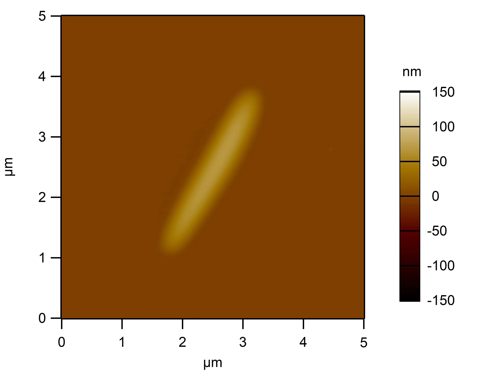
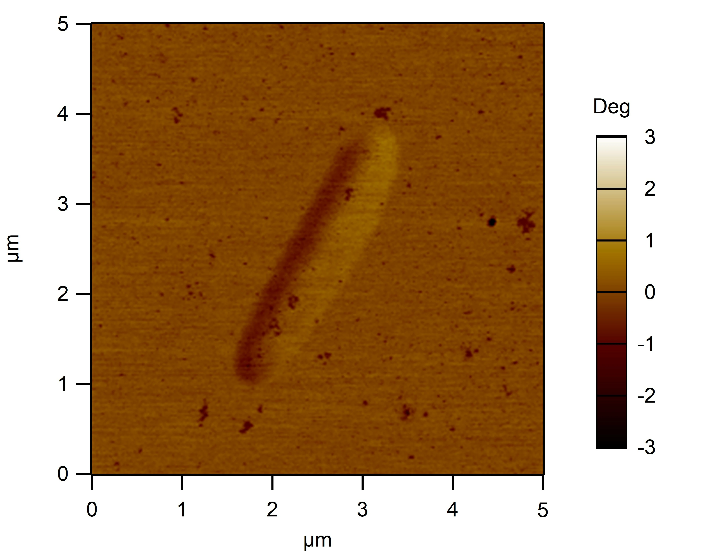
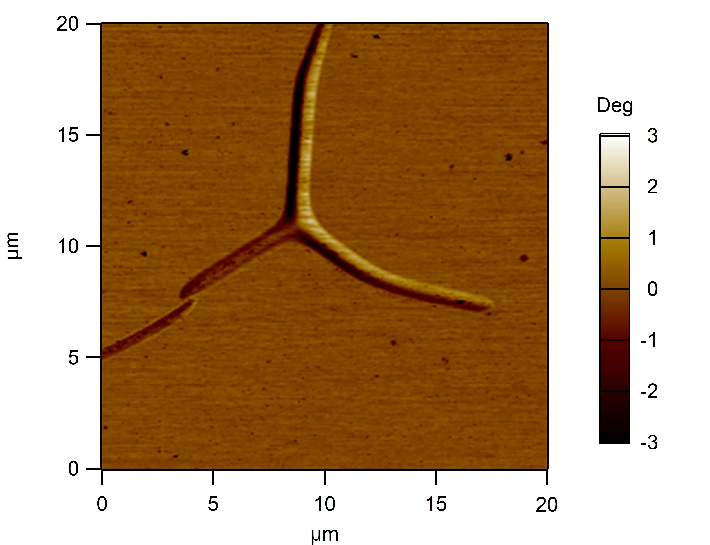

# BIOMOD 2025 实验记录

### 本文标注解释

在电泳的图像标注中，采用了对DNA链、各组装体的简写标注，以下为对电泳图像的标注解释

对于RDT相关链面体的标注

①**A、A1、A2、A3** 为对RDT的A面及其三条链的命名

②**B、B1、B2、B3** 为对RDT的B面及其三条链的命名

③**C、C1、C2、C3** 为对RDT的C面及其三条链的命名

④**D、D1、D2、D3** 为对RDT的D面及其三条链的命名

⑤**1+2、2+3、1+3** 为某个面的对应链组装的命名，在对单面的专门电泳表征中，取用的链属于电泳对应的面，其他情况下的电泳取用的链均属于A面

⑥**RDT** 为对刚性四面体的命名，后面的**0.1X**等为该四面体由四个面组装时的稀释比例，如0.1X为将ABCD等量混合至 10ul ，再加入 90ul 的1×TE Buffer，若出现多次稀释比例变化，如1× to 0.2×，即为将1×组装的稀释到0.2x时对应的DNA浓度并静置一段时间

⑦**S1、GS2、GS3、GS4**为对简单四面体的四条链的命名，其中后面三条链的字母G表示该链有能够形成G四链体的顶点序列

⑧**TDN-1、TDN-2、TDN-3、TDN-4**与⑦意思相同

⑨**TDN**即为简单四面体

在不同样品后标有时间与温度，表示该样品的组装是由对应时间的程序组装来的，并在对应温度下静置保存了若干时间（如有标注即为标注时间）

### 5.27

| 1×TE 缓冲液的配置 |                    |                      |        |
| ----------------- | ------------------ | -------------------- | ------ |
| 药品名            | 0.5M EDTA溶液 pH=8 | 1M Tris-HCl溶液 pH=8 | 超纯水 |
| 体积              | 200ul              | 1000ul               | 98.8ml |

对12管DNA干粉用离心机进行25°C的6500rpm离心2min

| 10uM DNA溶液的配置 |           |        |        |           |        |        |           |        |        |           |        |        |
| ------------------ | --------- | ------ | ------ | --------- | ------ | ------ | --------- | ------ | ------ | --------- | ------ | ------ |
| DNA链              | RDT-A1-G4 | RDT-A2 | RDT-A3 | RDT-B1-G4 | RDT-B2 | RDT-B3 | RDT-C1-G4 | RDT-C2 | RDT-C3 | RDT-D1-S1 | RDT-D2 | RDT-D3 |
| 对应缓冲液体积/ul  | 214       | 244    | 250    | 224       | 254    | 245    | 226       | 255    | 255    | 218       | 262    | 253    |

配置完成后，原料与缓冲液与DNA溶液放置于细胞培养室的4°C冰箱，DNA干粉放置于实验室内-20°C冰箱，本次实验使用了EDTA，内有钠离子，但浓度较低，对G4结合不至于产生影响，下次实验最好参考[2022年干扰线粒体论文的配置方法](D:\桌面\化学\BIOMOD\论文\2022-DNA四面体G4组装干扰线粒体-supporting_info.pdf)进行配置

### 6.5

实验方案：

组装程序：

配置溶液：

装钾组装：

取10ul RDT液与 10ul Tris-HCl K+ 混合

晚上：取两倍量合成ABCD面

### 6.6

电泳：

实验结果：

**35°C保温1h后**

电泳：

结果：

电泳：样品量同上

结果：右图右侧

### 6.7~6.9

探索上样量

### 6.10

用safe green 作染色剂得到ABC面的条带，确认组装程序合理

### 7.1~7.3凌晨

换染料，用6h程序实验，B面组装复现成功，AC面复现失败，对D面进行探索，2%琼脂糖凝胶电泳

### 7.3~7.4

ABCD混合实验，D面组装成功，2%琼脂糖凝胶电泳

### 7.5

更换12h程序实验组装，没有显著改善，2%琼脂糖凝胶电泳

### 7.6

对两种程序的组装产物进行24h的4°C保温，A面成功，C面无明显变化，2%琼脂糖凝胶电泳

### 7.7

对C面组装浓度减半，6h程序，无明显变化，2%琼脂糖凝胶电泳

### 7.8

对几个面采用30min快速退火程序，无明显进展，2%琼脂糖凝胶电泳

对6h程序A面进行35°C下保温，对7.6结果复现失败，2%琼脂糖凝胶电泳

换用72h程序，无明显进展，2%琼脂糖凝胶电泳

### 7.9

A面常温保存六小时，复现失败，2%琼脂糖凝胶电泳

### 7.11

用6h程序重组ABC面，AC失败，B面成功，2%琼脂糖凝胶电泳

对6h程序A面进行35°C下24h的保温，失败，2%琼脂糖凝胶电泳

### 7.12

根据前期实验数据对1+2，1+3，2+3和A链分带的对比，改变1链用量，实验得到合适的A1用量，A面复现成功，2%琼脂糖凝胶电泳

### 7.13

增加了简单四面体的退火实验，对C2链进行了重新设计，C面趋于稳定组装，在6h与30min下简单四面体组装失败，2%琼脂糖凝胶电泳

### 7.14

学习DLS、电镜制样，得到12条链直接组装DLS结果，对ABCD面最好组装版本RDT进行2%凝胶电泳

 DLS结果

直接组装的RDT电镜结果

最优组装版本的RDT电镜结果

根据尺寸推断，背景小黑点应为目标样品RDT

### 7.15

数据整理，重新组装最优版本RDT，提高浓度便于进行DLS测试

### 7.16

对最优版本RDT进行DLS测试

对ABCD面进行电泳数据采集

A面，2%琼脂糖凝胶电泳

B面，2%琼脂糖凝胶电泳

C面，2%琼脂糖凝胶电泳

D面，2%琼脂糖凝胶电泳

### 7.17

休息

### 7.18

第一管A1链用完，对第二管A1链进行用量实验，对C面重组装，2%琼脂糖凝胶电泳

### 7.19

对重组装的C面进行电泳分析，重测最优RDT的DLS，测试失败，2%琼脂糖凝胶电泳

### 7.20

混合RDT

### 7.21

对RDT进行了0.5%琼脂糖凝胶电泳

对简单四面体的不同组装形式进行琼脂糖凝胶电泳条带探索对RDT直接混合1X进行DLS测试

### 7.22

对RDT进行不同浓度组装对比，电镜铜网制样，0.5%琼脂糖凝胶电泳

### 7.23

对简单四面体进行12h程序组装测试，3%琼脂糖凝胶电泳

对RDT直接组装1X进行电镜测试

用琼脂糖凝胶模板法（两相法）和液相组装法进行高级结构的组装

### 7.24

对组装体与单体进行原子力显微镜、透射电镜观察

**液相组装法**，从宽高比看疑似盐结晶

**琼脂糖凝胶模板法（两相法）**，2、3组与组装结构类似

组装体电镜结果，呈现支化高分子形状

### 7.25

对单体进行超高分辨率电镜观察

### 7.26~7.29

休整

### 7.30

对RDT进行切胶分离前电泳测试，未出现合适条带，0.5%琼脂糖凝胶电泳

### 7.31

进行图片相关组装样的电镜制样

对简单四面体进行24h程序退火，3%琼脂糖凝胶电泳

对两面三面结合样品和RDT进行0.5%琼脂糖凝胶电泳

### 8.1

组装体高分辨电镜，出现囊块

1000mM钾离子1：1加入

250mM 1:9加入

### **8.2**

做了个电泳，待传图

### **8.3**

对久置ABCD面进行再次验证与琼脂糖凝胶电泳，3%琼脂糖凝胶电泳

根据图片结果，室温久置对ABCD面质量造成影响，重新过一遍6h退火程序

对不同组装时长、温度RDT做琼脂糖凝胶电泳，待传图

### 8.4

对重新过退火程序的ABCD面和不同组装时长的RDT做琼脂糖凝胶电泳，待传图

### 8.5

对不同组装时长的RDT作琼脂糖凝胶电泳，预备切胶分离，未找到合适条带，待传图

### 8.7

对样品进行透射电镜观察

**1号样**        0.1X -RDT稀释10倍_1比1加入250mM钾离子

浅浅比个心

此样品单体结合度较低，推测环形排列是由于制样时的咖啡环效应导致的

**2号样**         0.1X -RDT稀释10倍_1比1加入1000mM钾离子

咖啡环效应仍存在，在铜网孔边缘处观察到支化树状高分子类型结构图

### 8.8（~8.12）

根据刘堃老师建议，调高镁离子浓度、调节钾离子浓度为250mM，在40度与4度之间进行温度循环，提高RDT单体浓度

### 8.10

调节不同温度对RDT处理1h，进行琼脂糖凝胶电泳，检验温度对RDT稳定性的影响，待传图

### 8.12

对循环处理的组装体进行透射电镜观察

**1号样**          200mM 镁离子浓度 RDT单体为0.1×浓度按1：1稀释

此样品的铜网几乎完全破裂，难以观察，在破裂铜网周围找到些许可观察样品

**2号样**         100mM 镁离子浓度 RDT单体为0.1×浓度按1：1稀释

此样品已初具二维膜特征

电镜观察完成后，重新配置溶液，保持镁离子钾离子浓度尽可能不变，提高RDT单体浓度，对组装样进行43度到4度的循环，增加循环时间

### 8.13~8.24

样品温度循环中

### 8.25

结束温度循环，准备对组装体进行电镜分析
